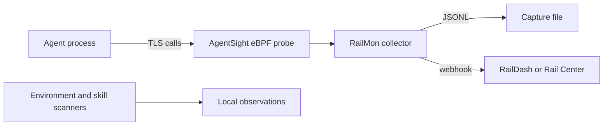

# RailMon

RailMon observes an AI agent's network activity and emits structured HTTP
interactions. It combines a Rust collector with AgentSight's eBPF TLS probe,
plus Python commands for environment scanning, skill discovery, and forwarding
captures to a webhook.

## Quick start

The collector requires Linux, a BTF-enabled kernel, and eBPF privileges:

```bash
git clone https://github.com/datrail/railmon.git
cd railmon
make demo
```

The demo builds the container, starts a local HTTPS target, captures its
traffic, and writes `out/capture.jsonl`. For direct collection:

```bash
make fetch-agentsight
cargo build --release
sudo ./target/release/railmon --agentsight bin/agentsight \
  --mode http --output capture.jsonl
```

Other commands do not require eBPF privileges:

```bash
docker build -t railmon .
docker run --rm railmon scan --mode self
docker run --rm railmon skills --help
docker run --rm railmon forward --help
```

Run `railmon help` for the command suite and `railmon --help` for collector
options. [`.env.example`](.env.example) lists supported configuration.

## Architecture



The probe attaches to supported TLS libraries and emits JSONL; the collector
normalizes HTTP interactions, redacts credential headers, and assigns stable
content-derived interaction IDs. Output can remain local for
[RailDash](https://github.com/datrail/raildash) or be forwarded to a configured
endpoint.

## Platforms and security

Collection is Linux-only and needs root or the relevant BPF capabilities. WSL2
works as Linux; Docker Desktop observes its Linux VM rather than native macOS
processes. The bundled AgentSight collector is x86_64, so `collect` and `demo`
are unavailable on arm64 while the Python commands remain usable.

Captured bodies are neither guaranteed complete nor redacted and may contain
credentials or private conversation data. Protect capture files as sensitive,
limit the monitored process, and do not run raw mode against a shared sink.
Read [SECURITY.md](SECURITY.md) and report vulnerabilities privately through
GitHub Security Advisories.

## Development

```bash
make test-python
make test-rust
make test
```

`make test-rust` runs formatting, Clippy, and Rust tests. `make demo` is a
separate privileged integration check and is not run by ordinary CI.

## Related projects

- [RailDash](https://github.com/datrail/raildash) visualizes captures.
- [DatRail Proxy](https://github.com/datrail/proxy) injects agent identity.
- [DatRail Gateway](https://github.com/datrail/gateway) enforces policy.

## License

Apache-2.0. See [LICENSE](LICENSE) and [NOTICE](NOTICE).
