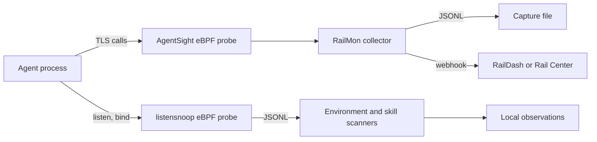

# RailMon

RailMon observes an AI agent's network activity and emits structured HTTP
interactions. It combines a Rust collector with AgentSight's eBPF TLS probe,
plus Python commands for environment scanning, skill discovery, and forwarding
captures to a webhook.

## Quick start

The collector requires Linux, a BTF-enabled kernel, and eBPF privileges:

```bash
git clone https://github.com/datrail/railmon.git
cd railmon
make demo
```

The demo builds the container, starts a local HTTPS target, captures its
traffic, and writes `out/capture.jsonl`. For direct collection:

```bash
make fetch-agentsight
cargo build --release
sudo ./target/release/railmon --agentsight bin/agentsight \
  --mode http --output capture.jsonl
```

Other commands do not require eBPF privileges:

```bash
docker build -t railmon .
docker run --rm railmon scan --mode self
docker run --rm railmon skills --help
docker run --rm railmon forward --help
```

The image builds from the ebpf-tls-tap submodule, so clone with
`--recursive` (or run `git submodule update --init --recursive`) first.

Run `railmon help` for the command suite and `railmon --help` for collector
options. [`.env.example`](.env.example) lists supported configuration.

## Architecture


```mermaid
flowchart LR
  agent[Agent process] -->|TLS calls| probe[AgentSight eBPF probe]
  probe --> collector[RailMon collector]
  scanner[Environment and skill scanners] --> output[Local observations]
  agent -->|listen, bind| listen[listensnoop eBPF probe]
  listen -->|JSONL| scanner
  collector -->|JSONL| file[Capture file]
  collector -->|webhook| dash[RailDash or Rail Center]
```

The probe attaches to supported TLS libraries and emits JSONL; the collector
normalizes HTTP interactions, redacts credential headers, and assigns stable
content-derived interaction IDs. Output can remain local for
[RailDash](https://github.com/datrail/raildash) or be forwarded to a configured
endpoint.

The collector's `--webhook`, `railmon forward` and `scan --register` present
the credential `RAIL_AUTH_MODE` names, matching Rail Center's
`RAIL_AUTH_MODES_ACCEPTED`: `none` (default) sends nothing; `bearer` sends
`RAIL_AUTH_TOKEN`, or the contents of `RAIL_AUTH_TOKEN_FILE`, re-read on every
batch or scan so a rotated secret needs no restart (setting both is refused);
`gcp` mints an identity token for `RAIL_AUTH_AUDIENCE` from the workload's
service account via the metadata server and keeps it only in memory. A
credential that cannot be produced stops the collector at startup, drops a
later batch, and fails a scan's registration; nothing is ever sent anonymously
instead. A token set beside `none` is refused as a likely
misconfiguration. RailDash's webhook ignores the header, so the default needs
no change for a local stack.

To monitor several agents in one sandbox, each attributed separately, see
[docs/multi-agent-targets.md](docs/multi-agent-targets.md).

### Listening sockets

An agent that opens a port is offering a service nobody declared.
`railmon listen` runs [listensnoop](https://github.com/datrail/ebpf-tls-tap#listening-sockets)
in the agent's PID namespace. It appends one line per socket the agent opens
to accept traffic to `RAIL_LISTEN_FILE`, which an interval scan turns into
the bundle's `observed_listeners`, and a line per new client address that
connects in, which becomes `observed_ingress_peers`. A new listener, or a new
peer, is drift in RailDash. Use
two containers beside the agent, sharing a volume the agent does not mount:

```bash
docker volume create rail-listen
docker run -d --name rail-listen --restart unless-stopped --privileged --pid host \
  -v /var/run/docker.sock:/var/run/docker.sock -v rail-listen:/data \
  -e RAIL_LISTEN_CONTAINER=my-agent -e RAIL_LISTEN_FILE=/data/listen.jsonl \
  railmon listen
docker run -d --name rail-scan -v rail-listen:/data:ro \
  -v /var/run/docker.sock:/var/run/docker.sock \
  -e RAIL_LISTEN_FILE=/data/listen.jsonl -e RAIL_RAILDASH_URL=... -e RAIL_RAILDASH_TOKEN=... \
  railmon scan --mode docker --container my-agent --interval 300
```

With `RAIL_LISTEN_CONTAINER`, a supervisor in the host PID namespace waits for
the agent container, enters its PID namespace with `nsenter` and runs the
probe there. The agent cannot see or signal the supervisor. When the probe
exits, because the agent restarted or killed it, the supervisor attaches
again. Start `listen` before the scan: it creates the file, and a scan fails
while the file is missing.

The probe runs with two options:
- `-n`, so only the agent's namespace is recorded;
- a heartbeat every 60 seconds (`RAIL_LISTEN_HEARTBEAT`).

The agent may be able to kill the probe: it shares the probe's PID
namespace, though a host's security profile can stop it. The probe crashes or
restarts too, and it does not report sockets that are already listening when
it attaches. So any restart leaves a gap, and the
scan says so: `observed_listeners` goes PARTIAL, which is drift, in three
cases:
- a second start record;
- a heartbeat older than three intervals;
- no start record at all (the probe never attached).

A restart never reads as "no new listeners". The note counts restarts, so
each one is a single drift: accepting it in RailDash stays aligned until the
next restart. Sockets that were already listening when `listen` first started
are not recorded. Start it before the agent, or restart the agent once it is
running. Only the `listen` container is privileged. The agent can't reach the
volume, so it can't edit its own record.
See
[the scanner's README](tools/agent-environment-scanner/README.md#observed-listeners-optional)
for what the attribute holds.

## Platforms and security

Collection is Linux-only and needs root or the relevant BPF capabilities. WSL2
works as Linux; Docker Desktop observes its Linux VM rather than native macOS
processes. The bundled AgentSight collector is x86_64, so `collect` and `demo`
are unavailable on arm64 while the Python commands remain usable.

Captured bodies are neither guaranteed complete nor redacted and may contain
credentials or private conversation data. Protect capture files as sensitive,
limit the monitored process, and do not run raw mode against a shared sink.
Read [SECURITY.md](SECURITY.md) and report vulnerabilities privately through
GitHub Security Advisories.

## Development

```bash
make test-python
make test-rust
make test
```

`make test-rust` runs formatting, Clippy, and Rust tests. `make demo` is a
separate privileged integration check and is not run by ordinary CI.

## Related projects

- [RailDash](https://github.com/datrail/raildash) visualizes captures.
- [DatRail Proxy](https://github.com/datrail/proxy) injects agent identity.
- [DatRail Gateway](https://github.com/datrail/gateway) enforces policy.

## License

Apache-2.0. See [LICENSE](LICENSE) and [NOTICE](NOTICE).
