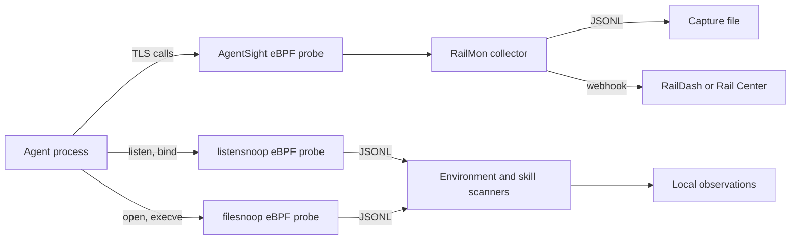

# RailMon

> **Just want to run DatRail?** Start at
> [datrail-project](https://github.com/datrail/datrail-project#quick-start):
> one `docker compose up -d` runs RailMon, RailDash and a demo agent
> together. This README covers RailMon on its own.

RailMon observes an AI agent's network activity and emits structured HTTP
interactions. It combines a Rust collector with AgentSight's eBPF TLS probe,
plus Python commands for environment scanning, skill discovery, and forwarding
captures to a webhook.

A scan produces an evidence bundle, which
[RailDash](https://github.com/datrail/raildash) turns into an Agent Security
Profile (ASP): what the agent is set up to use and was observed doing. Once an
ASP is locked as the baseline, later scans that differ from it are drift.
These terms are defined in the
[DatRail glossary](https://github.com/datrail/datrail-project/blob/master/docs/glossary.md).

## Quick start

The collector requires Linux, a BTF-enabled kernel, and eBPF privileges:

```bash
git clone https://github.com/datrail/railmon.git
cd railmon
make demo
```

The demo builds the container, starts a local HTTPS target, captures its
traffic, and writes `out/capture.jsonl`. For direct collection:

```bash
make fetch-agentsight
cargo build --release
sudo ./target/release/railmon --agentsight bin/agentsight \
  --mode http --output capture.jsonl
```

In `--mode http` a request is paired with the next response on its thread.
One still unanswered after `--pending-timeout` seconds (600, ten minutes, by default) is
written as an interaction with `"incomplete": true` and no response, and the
collector logs how many it wrote and how many responses matched no request.
The probe reports threads, not connections, and a Node agent does all its
TLS on one thread. A read from another connection (a WebSocket frame, say)
that arrives between two chunks of a chunked reply is kept out of that reply,
so the reply still comes through whole. Two HTTP connections busy on one thread
can still lose a reply or pair it with the wrong response, as can a foreign
read landing in the middle of a chunk or a reply that is not chunked
([#70](https://github.com/datrail/railmon/issues/70); the fix is a connection key upstream,
[eunomia-bpf/agentsight#208](https://github.com/eunomia-bpf/agentsight/issues/208)).

### Following a container

`railmon collect` with `RAIL_COLLECT_CONTAINER=<name or id>` (and the Docker
socket mounted, `--pid host`, `--privileged`) chooses the processes itself:

- it finds the first process in the container that maps a `libssl.so`, or
  whose executable has TLS built in — Node, Bun and other runtimes bundle
  OpenSSL or BoringSSL, so `--comm node` finds no library to hook and
  captures nothing;
- it runs the collector with `--binary-path` set to the kernel's link to that
  file (`/proc/<pid>/map_files/…` or `/proc/<pid>/exe`) and `--session` set
  to that process's session. The agent's processes in that session that use
  that file are captured; other sessions, the host's and `docker exec`'s
  included, are not. A child that starts its own session, or uses a
  different TLS library than the one found first, is not captured;
- it attaches again when the container restarts or is recreated, so the PID
  never has to be looked up.

Its log names the process and file it chose. A collector that keeps exiting
right after it starts ends the supervisor with the collector's status. It
refuses `--pid`, `--uid`, `--comm`, `--binary-path`, `--session` and
`--target-manifest`; leave `RAIL_COLLECT_CONTAINER` unset to pass those
yourself.

`railmon` with a command (`railmon collect`, `railmon scan`, …) is the
container image's entrypoint, so those commands work only inside the
container, e.g. `docker run --rm --privileged --pid host railmon collect …`.
There is no `sudo railmon collect` on the host: there the native build above
runs the collector directly, with collector flags and no command.

Other commands do not require eBPF privileges:

```bash
docker build -t railmon .
docker run --rm -e RAIL_HOST_ID=my-host railmon scan --mode self
docker run --rm railmon skills --help
docker run --rm railmon forward --help
```

The image builds from the ebpf-tls-tap submodule, so clone with
`--recursive` (or run `git submodule update --init --recursive`) first.

`scan` needs a host id (`RAIL_HOST_ID` or `--host-id`) to build its evidence
bundle; without one it exits 2 (see [Configuration](#configuration)).

For the command suite run `docker run --rm railmon help`, and for collector
options `docker run --rm railmon --help` (inside the container `railmon` is the
image's entrypoint; a native build's `./target/release/railmon --help` shows
the collector options only). [`.env.example`](.env.example) lists supported configuration.

## Architecture


```mermaid
flowchart LR
  agent[Agent process] -->|TLS calls| probe[AgentSight eBPF probe]
  probe --> collector[RailMon collector]
  scanner[Environment and skill scanners] --> output[Local observations]
  agent -->|listen, bind| listen[listensnoop eBPF probe]
  listen -->|JSONL| scanner
  agent -->|open, execve| files[filesnoop eBPF probe]
  files -->|JSONL| scanner
  collector -->|JSONL| file[Capture file]
  collector -->|webhook| dash[RailDash or Rail Center]
```

The probe attaches to supported TLS libraries and emits JSONL; the collector
normalizes HTTP interactions, redacts credential headers, and assigns stable
content-derived interaction IDs. Output can remain local for
[RailDash](https://github.com/datrail/raildash) or be forwarded to a configured
endpoint.

The collector's `--webhook`, `railmon forward` and `scan --register` present
the credential `RAIL_AUTH_MODE` names, matching Rail Center's
`RAIL_AUTH_MODES_ACCEPTED`: `none` (default) sends nothing; `bearer` sends
`RAIL_AUTH_TOKEN`, or the contents of `RAIL_AUTH_TOKEN_FILE`, re-read on every
batch or scan so a rotated secret needs no restart (setting both is refused);
`gcp` mints an identity token for `RAIL_AUTH_AUDIENCE` from the workload's
service account via the metadata server and keeps it only in memory. A
credential that cannot be produced stops the collector at startup, drops a
later batch, and fails a scan's registration; nothing is ever sent anonymously
instead. A token set beside `none` is refused as a likely
misconfiguration. RailDash's webhook ignores the header, so the default needs
no change for a local stack.

RailDash's own credential is separate. With `RAIL_RAILDASH_TOKEN`, or
`RAIL_RAILDASH_TOKEN_FILE` (re-read on every batch, so a rotated token needs
no restart; setting both is refused), every webhook batch also carries
RailDash's local write token in `X-RailDash-Token`, beside whatever
`RAIL_AUTH_MODE` puts in `Authorization`. RailDash's guardrails count only
captures that carry it. It goes to whatever `--webhook` names, so set it only
when the webhook is RailDash. The collector then also posts a heartbeat,
`{"collector_id", "taps_attached", "sent_at"}`, every 60 s while at least one
tap is attached, so RailDash can tell a quiet agent from a stopped collector.
The first goes one interval after start, none goes while every manifest
target is down, and none goes without the token, since RailDash refuses those.
Its URL is the webhook's scheme, host and port with the path
`/webhook/heartbeat`; a webhook path ending in `/webhook/http-interactions`
keeps whatever prefix comes before it (`/raildash/webhook/http-interactions`
becomes `/raildash/webhook/heartbeat`). It uses the webhook's 10 s timeout and
follows no redirect, and presents the same `RAIL_AUTH_MODE` credential as a
batch; a heartbeat whose credential can't be produced is skipped, never sent
without it. A failed heartbeat (any non-2xx) is logged once until the
outcome changes and never stops capture. A token that can't be read stops the
collector at startup and later drops the batch, like a credential, and the
token never appears in a log line. Logs name the heartbeat URL without its
userinfo, query or fragment.

To monitor several agents in one sandbox, each attributed separately, see
[docs/multi-agent-targets.md](docs/multi-agent-targets.md).

### Listening sockets

An agent that opens a port is offering a service nobody declared.
`railmon listen` runs [listensnoop](https://github.com/datrail/ebpf-tls-tap#listening-sockets)
in the agent's PID namespace. It appends one line per socket the agent opens
to accept traffic to `RAIL_LISTEN_FILE`, which an interval scan turns into
the bundle's `observed_listeners`, and a line per new client address that
connects in, which becomes `observed_ingress_peers`. A new listener, or a new
peer, is drift in RailDash. Use
two containers beside the agent, sharing a volume the agent does not mount:

```bash
docker volume create rail-listen
docker run -d --name rail-listen --restart unless-stopped --privileged --pid host \
  -v /var/run/docker.sock:/var/run/docker.sock -v rail-listen:/data \
  -e RAIL_LISTEN_CONTAINER=my-agent -e RAIL_LISTEN_FILE=/data/listen.jsonl \
  railmon listen
docker run -d --name rail-scan -v rail-listen:/data:ro \
  -v /var/run/docker.sock:/var/run/docker.sock \
  -e RAIL_LISTEN_FILE=/data/listen.jsonl -e RAIL_RAILDASH_URL=... -e RAIL_RAILDASH_TOKEN=... \
  railmon scan --mode docker --container my-agent --interval 300
```

With `RAIL_LISTEN_CONTAINER`, a supervisor in the host PID namespace waits for
the agent container, enters its PID namespace with `nsenter` and runs the
probe there. The agent cannot see or signal the supervisor. When the probe
exits, because the agent restarted or killed it, the supervisor attaches
again. Start `listen` before the scan: it creates the file, and a scan fails
while the file is missing.

The probe runs with two options:
- `-n`, so only the agent's namespace is recorded;
- a heartbeat every 60 seconds (`RAIL_LISTEN_HEARTBEAT`).

The probe itself does not report sockets that are already listening when it
attaches, and an agent that listens as soon as it starts usually beats it. So
at each attach the supervisor also reads the agent's socket table and records
every TCP socket listening and every UDP socket bound but not connected that a
process in the agent's PID namespace holds, marked `"snapshot": true`. The
scan treats those records like the probe's. A snapshot cannot tell whether
the kernel chose the port, so such a port is listed by number.

The agent may be able to kill the probe: it shares the probe's PID
namespace, though a host's security profile can stop it. The probe crashes or
restarts too. A socket opened and closed while it was down is missed, so any
restart leaves a gap, and the
scan says so: `observed_listeners` goes PARTIAL, which is drift, for a
probe gap in three cases (and also for lost events or past 256 distinct
listeners):
- a second start record;
- a heartbeat older than three intervals;
- no start record at all (the probe never attached).

A restart never reads as "no new listeners". The note counts restarts, so
each one is a single drift: accepting it in RailDash stays aligned until the
next restart. Without `RAIL_LISTEN_CONTAINER` (the probe run directly, in the
agent's namespace) there is no snapshot: sockets already listening when it
starts are not recorded, so start it before the agent. Only the `listen`
container is privileged. The agent can't reach the
volume, so it can't edit its own record.
See
[the scanner's README](tools/scan/README.md#observed-listeners-optional)
for what the attribute holds.

### Opened files

`railmon files` does the same for files. It runs
[filesnoop](https://github.com/datrail/ebpf-tls-tap#file-opens) in the agent's PID
namespace, which appends a line the first time a process opens a regular file
to read, write or run it. An interval scan turns those lines into the bundle's
`observed_file_access`: what the kernel saw the sandbox open, kept apart from
anything a configuration declares or a tool call asked for. A newly written
path is drift in RailDash. A randomly named temp file (Python's `tempfile`,
`mkstemp`, `mktemp`, a Vim swap file) under `/tmp`, `/var/tmp`, `/dev/shm` or
in the agent's `$TMPDIR` is first folded into one templated path such as
`/tmp/tmp*`, so a new random name each run is not drift, while a new name
that fits no pattern, like `/tmp/exfil.tar`, still is. A `/proc` path under
a process or thread ID is listed with `*` for the ID, so the container
runtime's init for each `docker exec` into the agent is one entry, not a new
one per process. The deployment is the
listener one with its own variables (`RAIL_FILES_CONTAINER`, `RAIL_FILES_FILE`,
`RAIL_FILES_HEARTBEAT`), and the scan reads both files:

```bash
docker run -d --name rail-files --restart unless-stopped --privileged --pid host \
  -v /var/run/docker.sock:/var/run/docker.sock -v rail-listen:/data \
  -e RAIL_FILES_CONTAINER=my-agent -e RAIL_FILES_FILE=/data/files.jsonl \
  railmon files
docker run -d --name rail-scan -v rail-listen:/data:ro \
  -v /var/run/docker.sock:/var/run/docker.sock \
  -e RAIL_LISTEN_FILE=/data/listen.jsonl -e RAIL_FILES_FILE=/data/files.jsonl \
  -e RAIL_RAILDASH_URL=... -e RAIL_RAILDASH_TOKEN=... \
  railmon scan --mode docker --container my-agent --interval 300
```

The same supervisor keeps filesnoop attached across agent restarts and kills.
filesnoop reports each file again for every new process, so the supervisor
appends only the first record of each distinct access (the same path, access
and open flags), counting what the file already holds. An agent that starts a
process per task then adds lines only when it opens something new, and the
scan, which reads the whole file each interval, stays as fast as on day one.
Each restart, a stale heartbeat or no start record makes the attribute
PARTIAL, as for listeners. filesnoop does not report files already open when
it attaches, so start `files` before the agent. It reports paths, never file
content, but paths can be sensitive; the volume holding them should be as
private as the agent's own files. See
[the scanner's README](tools/scan/README.md#observed-file-access-optional)
for what the attribute holds and how it is bounded.

## Configuration

Every setting is an environment variable; RailMon loads no `.env` file
itself. [`.env.example`](.env.example) lists every variable the code reads.
The ones you are most likely to set:

| Variable | Read by | Default | What it does |
| --- | --- | --- | --- |
| `RAIL_HOST_ID` | `scan` (`--host-id`), collector heartbeat | none | Names the host in the evidence bundle and the registration; the same value RailProxy and the other Rail components on the host use. No fallback is invented: unset, the bundle fails its contract and `scan` exits 2 unless `--no-evidence-bundle` is given and no RailDash URL is set. The collector's heartbeat `collector_id` is it (else the hostname), `:`, and the collector's PID. |
| `RAIL_AGENT_KEY` | `scan` (`--agent-key`) | none | The agent's key in RailDash, sent as `?agent_key=` with the bundle. With `--register` a single scan also sends it to Rail Center as `?agent_key=`, since a v1 bundle names no key; there it must match `^[a-z0-9][a-z0-9._-]{0,63}$`. RailDash needs it when the bundle carries no deployment pair (`RAIL_DEPLOYMENT` plus `RAIL_NAMESPACE`, or a Compose project and service). |
| `RAIL_RAILDASH_URL` | `scan` (`--raildash-url`) | none | Setting it is the request to deliver each evidence bundle to RailDash's `/v1/evidence-bundles`. |
| `RAIL_RAILDASH_TOKEN` | `scan`, collector `--webhook` | none | RailDash's local write token (`X-RailDash-Token`): the `RAILDASH_TOKEN` RailDash runs with, or else the contents of its persisted `<db path>.token`. Stable across RailDash restarts, except that an in-memory RailDash database without `RAILDASH_TOKEN` gets a new one on every start; RailDash never prints it. The collector sends it on every webhook batch and heartbeat (see [Architecture](#architecture)). |
| `RAIL_RAILDASH_TOKEN_FILE` | collector `--webhook` | none | A file holding that token instead, re-read on every batch and heartbeat. Not with `RAIL_RAILDASH_TOKEN`. |
| `RAIL_HEARTBEAT_INTERVAL` | collector `--webhook` | `60` | Seconds between heartbeats, for tests (0.1 to 3600; anything that is not a positive number means 60). RailDash treats a collector with no heartbeat for 3 minutes as stopped. |
| `RAIL_SCAN_INTERVAL_IN_SECONDS` | `scan` (`--interval`) | unset: scan once and exit | Keeps `scan` running and scans again on this interval (3600 if the value is not a number). Set but empty counts as set, so it scans every 3600 seconds. |
| `RAIL_CENTER_URL` | `scan --register` (`--center-url`), `forward` | none | Rail Center's base URL. `scan --register` sends it the evidence bundle at `/v1/agents/register` (needs Rail Center with RC-387). |
| `RAIL_AUTH_MODE` | collector `--webhook`, `forward`, `scan --register` | `none` | The credential to present: `none`, `bearer` or `gcp`. See above for `RAIL_AUTH_TOKEN`, `RAIL_AUTH_TOKEN_FILE` and `RAIL_AUTH_AUDIENCE`. |
| `RAIL_OBSERVED_FILE` | `scan` (`--observed-file`) | none | AgentSight snapshot summarised into observed reach. |
| `RAIL_LISTEN_FILE` | `scan` (`--listen-file`), `listen` | none | listensnoop's JSON lines: where `listen` appends and `scan` reads. |
| `RAIL_FILES_FILE` | `scan` (`--files-file`), `files` | none | filesnoop's JSON lines: where `files` appends and `scan` reads. |
| `RAIL_TARGET_MANIFEST` | `scan` (`--target-manifest`) | none | The multi-agent target manifest; see [docs/multi-agent-targets.md](docs/multi-agent-targets.md). |
| `RAIL_EVIDENCE_BUNDLE_OUTPUT` | `scan` (`--evidence-bundle-output`) | `.rail/railmon/evidence-bundle.json` | Where the evidence bundle is written. |
| `AGENTSIGHT_PATH` | collector (`--agentsight`) | `SSLSNIFF_PATH`, else `bin/agentsight` if it exists, else `/usr/local/bin/agentsight`; the image sets its own | The AgentSight probe binary. |
| `RAIL_COLLECT_CONTAINER` | `collect` | none | Capture one container's agent: see [Following a container](#following-a-container). |

A flag always wins over its variable. `scan` exits 2 when the evidence bundle
it built fails its contract, when a delivery (`--register` or RailDash) fails,
or when the feature file cannot be written.

An interval scan whose evidence bundle has not changed since the previous
scan re-sends that bundle, `bundle_id` and all, so RailDash answers
`duplicate` and keeps one ASP for it instead of one per interval. The bundle's
`collected_at` is then when that content was first collected. A restarted
`scan` starts afresh and sends a new bundle once.

## Platforms and security

Collection is Linux-only and needs root or the relevant BPF capabilities. WSL2
works as Linux; Docker Desktop observes its Linux VM rather than native macOS
processes. The bundled AgentSight collector is x86_64, so `collect` and `demo`
are unavailable on arm64 while the Python commands remain usable.

Captured bodies are neither guaranteed complete nor redacted and may contain
credentials or private conversation data. Protect capture files as sensitive,
limit the monitored process, and do not run raw mode against a shared sink.
Read [SECURITY.md](SECURITY.md) and report vulnerabilities privately through
GitHub Security Advisories.

## Development

```bash
make test-python
make test-rust
make test
```

`make test-rust` runs formatting, Clippy, and Rust tests. `make demo` is a
separate privileged integration check and is not run by ordinary CI.

## Related projects

- [RailDash](https://github.com/datrail/raildash) visualizes captures.
- [DatRail Proxy](https://github.com/datrail/proxy) injects agent identity.
- [DatRail Gateway](https://github.com/datrail/gateway) enforces policy.

## License

Apache-2.0. See [LICENSE](LICENSE) and [NOTICE](NOTICE).
